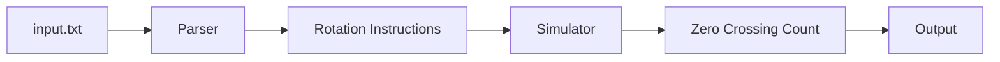

# Design Document

## Overview

The safe dial rotation system is a command-line application that simulates a circular dial with 100 positions (0-99) and processes a sequence of rotation instructions to count how many times the dial points at position 0. The system supports two counting methods:

1. **Original method**: Counts only when the dial lands on 0 at the end of a rotation
2. **Method 0x434C49434B**: Counts every time the dial points at 0, including all passes through 0 during a rotation

The system follows a simple pipeline: parse input → simulate rotations → count zero occurrences → output result.

The application will be implemented in Rust, leveraging its strong type system and error handling capabilities to ensure correctness and robustness.

## Architecture

The system follows a modular architecture with three main components:

1. **Parser Module**: Reads and parses rotation instructions from the input file
2. **Simulator Module**: Maintains dial state and applies rotations with wraparound logic
3. **Main Module**: Orchestrates the flow and handles I/O



## Components and Interfaces

### Rotation Type

Represents a single rotation instruction:

```rust
enum Direction {
    Left,
    Right,
}

struct Rotation {
    direction: Direction,
    distance: u32,
}
```

### Parser Module

**Responsibility**: Parse rotation instructions from text format

**Interface**:
```rust
fn parse_rotations(input: &str) -> Result<Vec<Rotation>, ParseError>
fn parse_rotation_line(line: &str) -> Result<Rotation, ParseError>
```

**Behavior**:
- Reads lines from input string
- Extracts direction (L/R) and distance
- Returns vector of Rotation structs or error

### Simulator Module

**Responsibility**: Apply rotations and track dial position

**Interface**:
```rust
enum CountingMethod {
    EndOfRotation,    // Original method
    AllPasses,        // Method 0x434C49434B
}

struct Dial {
    position: u32,
}

impl Dial {
    fn new() -> Self  // Starts at position 50
    fn rotate(&mut self, rotation: &Rotation) -> u32  // Returns new position
    fn rotate_with_count(&mut self, rotation: &Rotation) -> u32  // Returns count of passes through 0
    fn position(&self) -> u32
}

fn count_zero_crossings(rotations: &[Rotation]) -> u32
fn count_all_zero_passes(rotations: &[Rotation]) -> u32
fn count_zeros_through_rotation(start_pos: u32, rotation: &Rotation) -> u32
```

**Behavior**:
- Maintains current dial position
- Applies rotations with modulo 100 wraparound
- Tracks and counts when position equals 0
- For method 0x434C49434B, calculates how many times the dial passes through 0 during each rotation

### Main Module

**Responsibility**: Coordinate execution and handle I/O

**Interface**:
```rust
fn main() -> Result<(), Box<dyn Error>>
fn read_input_file(path: &str) -> Result<String, io::Error>
```

**Behavior**:
- Reads input.txt file
- Calls parser and simulator
- Outputs final result

## Data Models

### Rotation

- `direction`: Enum indicating Left or Right
- `distance`: Unsigned integer representing clicks to rotate

### Dial

- `position`: Current position (0-99)
- Invariant: position is always in range [0, 99]

### ParseError

Custom error type for parsing failures:
- Invalid direction character
- Missing distance value
- Invalid distance format
- Line number for error reporting

##
Correctness Properties

*A property is a characteristic or behavior that should hold true across all valid executions of a system—essentially, a formal statement about what the system should do. Properties serve as the bridge between human-readable specifications and machine-verifiable correctness guarantees.*

### Property 1: Parsing round trip

*For any* valid rotation instruction string in the format "[L|R][distance]", parsing the string and then formatting it back should preserve the direction and distance values.

**Validates: Requirements 1.1, 1.2, 1.3, 1.4**

### Property 2: Multi-line parsing completeness

*For any* sequence of valid rotation instruction lines, parsing should produce exactly the same number of Rotation objects as there are non-empty lines in the input.

**Validates: Requirements 1.5**

### Property 3: Right rotation arithmetic

*For any* starting position p (0-99) and distance d, applying a right rotation should result in position (p + d) mod 100.

**Validates: Requirements 2.1**

### Property 4: Left rotation arithmetic

*For any* starting position p (0-99) and distance d, applying a left rotation should result in position (p - d) mod 100, where negative results wrap to the range [0, 99].

**Validates: Requirements 2.2**

### Property 5: Zero crossing detection

*For any* sequence of rotations, the count of zero crossings should equal the number of rotations that result in position 0.

**Validates: Requirements 3.1, 3.2, 3.3**

### Property 6: Invalid input error reporting

*For any* invalid rotation instruction string (missing direction, invalid direction character, or non-numeric distance), parsing should return an error.

**Validates: Requirements 4.4**

### Property 7: Right rotation zero pass counting

*For any* starting position p (0-99) and right rotation distance d, the number of times the dial passes through 0 during the rotation should equal floor((p + d) / 100).

**Validates: Requirements 6.4**

### Property 8: Left rotation zero pass counting

*For any* starting position p (0-99) and left rotation distance d, the number of times the dial passes through 0 during the rotation should equal floor((100 - p + d) / 100).

**Validates: Requirements 6.5**

### Property 9: Method 0x434C49434B counts all passes

*For any* sequence of rotations, using method 0x434C49434B should count every pass through 0 during rotations, which should be greater than or equal to the count from the original method.

**Validates: Requirements 7.3**

### Property 10: Original method unchanged

*For any* sequence of rotations, the original counting method should still count only positions that equal 0 at the end of a rotation, ignoring passes through 0 during the rotation.

**Validates: Requirements 7.2**

## Error Handling

The system uses Rust's Result type for error handling:

### Parse Errors

- **InvalidDirection**: Line contains character other than L or R as first character
- **MissingDistance**: Line has direction but no distance value
- **InvalidDistance**: Distance value is not a valid unsigned integer
- **EmptyLine**: Line is empty or whitespace only (should be skipped, not error)

### File I/O Errors

- **FileNotFound**: input.txt does not exist
- **ReadError**: Permission or I/O error reading file

All errors should include context (line number for parse errors, file path for I/O errors) to aid debugging.

## Testing Strategy

The system will use a dual testing approach combining unit tests and property-based tests.

### Unit Testing

Unit tests will verify:
- Specific examples from the problem statement (the example sequence that results in 3 zero crossings)
- Initial dial position is 50 (Requirements 2.5)
- Initial position is not counted as a zero crossing (Requirements 3.4)
- File not found error handling (Requirements 4.3)
- Edge cases like empty input files

### Property-Based Testing

Property-based tests will use the **proptest** crate for Rust. Each property test will run a minimum of 100 iterations with randomly generated inputs.

Property tests will verify:
- **Property 1**: Parsing round trip - generate random valid rotation strings, parse them, verify direction and distance are extracted correctly
- **Property 2**: Multi-line parsing completeness - generate random sequences of rotation lines, verify count matches
- **Property 3**: Right rotation arithmetic - generate random positions and distances, verify (p + d) mod 100
- **Property 4**: Left rotation arithmetic - generate random positions and distances, verify (p - d) mod 100 with proper wraparound
- **Property 5**: Zero crossing detection - generate random rotation sequences, manually calculate expected zeros, verify count
- **Property 6**: Invalid input error reporting - generate invalid rotation strings, verify errors are returned

Each property-based test must be tagged with a comment explicitly referencing the correctness property using this format: `// Feature: safe-dial-rotation, Property {number}: {property_text}`

Generators should be smart:
- Position generator: uniform distribution over [0, 99]
- Distance generator: include small values, large values, and values that cause wraparound
- Direction generator: equal probability of L and R
- Invalid input generator: missing direction, invalid characters, missing distance, non-numeric distance

### Integration Testing

Integration tests will:
- Test reading from an actual input.txt file
- Verify end-to-end execution with known inputs
- Test the example from the problem statement

## Implementation Notes

### Modulo Arithmetic for Wraparound

Rust's modulo operator `%` returns negative values for negative operands. For left rotations, we need to ensure proper wraparound:

```rust
// Correct left rotation
let new_position = ((position as i32 - distance as i32).rem_euclid(100)) as u32;

// Or alternatively
let new_position = (position + 100 - (distance % 100)) % 100;
```

### Counting Passes Through Zero (Method 0x434C49434B)

The key insight is that we need to count how many times the dial crosses position 0 during a rotation, not just whether it ends there.

**Right Rotation**: Starting at position `p`, rotating right by distance `d`:
- The dial visits positions: p, p+1, p+2, ..., p+d (all mod 100)
- Position 0 is visited when (p + k) mod 100 = 0, which means p + k = 100n for some integer n
- The number of times we hit 0 is: `floor((p + d) / 100)`
- Special case: if we end exactly at 0, that counts as one pass

**Left Rotation**: Starting at position `p`, rotating left by distance `d`:
- The dial visits positions: p, p-1, p-2, ..., p-d (all mod 100)
- We can think of this as rotating right by (100 - (d mod 100)) from position p
- Or more directly: we pass through 0 when going from p down to p-d
- The number of times we hit 0 is: `floor((100 - p + d) / 100)` if p > 0, or special handling if p = 0

**Example**: Starting at position 82, rotating left by 68:
- We go: 82 → 81 → ... → 1 → 0 → 99 → ... → 14
- We pass through 0 once during this rotation
- Formula: floor((100 - 82 + 68) / 100) = floor(86 / 100) = 0... wait, this needs adjustment
- Actually: we cross 0 when we go from position 1 to position 0, then continue to 99, 98, etc.
- Better formula: `(p + d) / 100` for left rotations where we treat it as distance traveled

**Simplified approach**:
- For right rotation from p by d: count = `(p + d) / 100`
- For left rotation from p by d: count = `(100 - p + d) / 100` if we need to cross 0, else 0

### Performance Considerations

The system processes rotations sequentially. For the given input size (~2000 rotations), performance is not a concern. The implementation prioritizes clarity and correctness over optimization.

### File I/O

Use `std::fs::read_to_string` for simple file reading. The entire file fits comfortably in memory.
